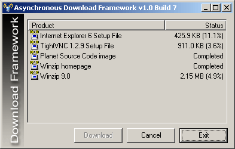

## Framework \- Asynchronous Download v1\.0\.7 \(Download files from Web using AsyncRead, no OCX, no API\)

### Description

This project shows a framework of how asynchronous downloading from web is done using AsyncRead. Any image, file, page, etc. can be downloaded using this method. No Windows API calls and no winsock OCX needed. Credits to Chloe!

More info on AsyncRead can be found at http://msdn.microsoft.com/library/default.asp?url=/library/en-us/vb98/html/vbmthasyncread.asp
 
### More Info
 

             |
---                |---
**Submitted On**   |2004-08-04 02:40:32
**By**             |[Dennis Lee](https://github.com/Planet-Source-Code/PSCIndex/blob/master/ByAuthor/dennis-lee.md)
**Level**          |Intermediate
**User Rating**    |4.9 (74 globes from 15 users)
**Compatibility**  |VB 6\.0
**Category**       |[Internet/ HTML](https://github.com/Planet-Source-Code/PSCIndex/blob/master/ByCategory/internet-html__1-34.md)
**World**          |[Visual Basic](https://github.com/Planet-Source-Code/PSCIndex/blob/master/ByWorld/visual-basic.md)
**Archive File**   |[Framework\_177755842004\.zip](https://github.com/Planet-Source-Code/dennis-lee-framework-asynchronous-download-v1-0-7-download-files-from-web-using-asyncread-__1-55334/archive/master.zip)

